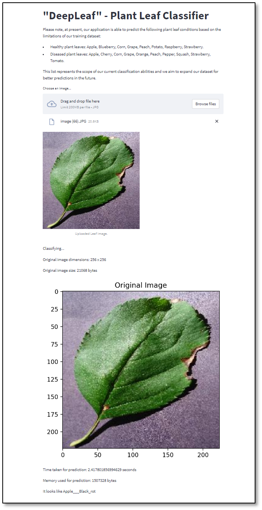

# "DeepLeaf" v1.0: A Streamlit-Based Web Application for Plant Leaf Classification

## Introduction

"DeepLeaf" is a Streamlit-based web application that utilizes a pre-trained ResNet50 model for classifying plant leaf diseases. The application allows users to upload leaf images and returns classification predictions based on the model's learning.

You can read more details about the research problem, dataset information, implementation details, results, and future work in the project's [here](https://github.com/7ev3r/Capstone/blob/7139847e4fbd97e173881cbdcf33c48af632ab4f/Capstone_05_2023.ipynb). It serves as a comprehensive guide to the project and provides insights into the motivation, approach, and outcomes of the research.

The `app.py` file located in the repository is an important part of the project. It contains the code for a Streamlit-based web application "DeepLeaf" that uses our trained ResNet50 model to classify plant leaf diseases. Users can upload an image of a leaf, and the app will return the likely class (species and health condition) of the plant.

## Assignment Problem 

The health and wellbeing of plants play a critical role in agriculture, gardening, and environmental conservation. One of the key aspects of maintaining plant health is the ability to identify and diagnose plant diseases accurately, which traditionally relies on human expertise and laborious visual examination of plant leaves. However, such manual methods are prone to inaccuracies and inconsistencies.

In light of recent advancements in machine learning and deep learning, the potential to automate the process of plant disease identification and diagnosis has emerged. It could offer a quicker, more precise, and less labor-intensive approach to assessing plant health. Therefore, the central research question we aim to address in this study is: Can deep learning techniques effectively identify plant species and assess their health based on images of their leaves?

## Dataset Information

The data employed for this study was sourced from a publicly accessible dataset hosted on Mendeley Data, available at the following link: [Mendeley Data](https://data.mendeley.com/datasets/tywbtsjrjv/1). The dataset comprises 61,486 images, capturing a wide range of plant species, each represented by its leaves. Furthermore, this dataset spans a spectrum of health conditions for each plant species - from healthy states to various stages and types of diseases.

The dataset includes the following plant species:

- Apple
- Blueberry
- Cherry
- Corn
- Grape
- Orange
- Peach
- Pepper
- Potato
- Raspberry
- Soybean
- Squash
- Strawberry
- Tomato

Each plant category consists of subcategories representing different health conditions, such as various diseases and healthy states. In total, the dataset encompasses 39 different classes of plant leaves and background images. To enhance the robustness of the dataset and facilitate better model generalization, the dataset was subjected to augmentation using six different techniques, namely, image flipping, Gamma correction, noise injection, PCA color augmentation, rotation, and scaling.

Given its rich diversity and extensive augmentation, this dataset serves as an invaluable resource for developing and testing our deep learning model, aiming at automated plant identification and disease diagnosis.

## How it Works

Here's a step-by-step overview of what the application does:

1. **Model Loading:** The application loads the pre-trained model from a specified location.
2. **Image Upload Interface:** It provides a user-friendly web interface for users to upload an image of a leaf.
3. **Image Resizing:** Once an image is uploaded, it resizes the image to match the input size of the model.
4. **Image Display:** The uploaded image is displayed on the web interface.
5. **Image Pre-processing:** The application pre-processes the image in the same way it was done during the model training phase.
6. **Prediction:** The image is then fed to the model to get a prediction.
7. **Prediction Display:** The prediction is displayed on the web interface.

## Running the Application

To use "DeepLeaf" on your local machine, follow these steps:

1. **Installation:** Ensure all the necessary libraries are installed. You can install them using pip:
   ```
   pip install streamlit tensorflow pillow matplotlib numpy
   ```

2. **Script Saving:** Save the provided Python script to a file, e.g., `app.py`.

3. **Path Check:** Make sure the path to the model and training directory in the script matches the actual path on your system.

4. **App Execution:** Run the application using Streamlit. In your terminal, navigate to the directory containing the `app.py` file and execute the following command:
   ```
   streamlit run app.py
   ```

5. **Accessing the App:** Open a web browser and go to `localhost:8501` to view and interact with the application.

**Note:** The application expects the image to be in JPG format, and the model to be compatible with TensorFlow 2.x version.

## Source Code

The source code for the application can be found [here](https://github.com/7ev3r/Capstone/blob/eca51a6158faa40d9b5f8d87db5246471c3071b4/app.py).

## App preview



## Future Developments

We are continuously working on improving "DeepLeaf" by refining the model's accuracy and integrating additional features. Your feedback and contributions are welcome.

## References

1. Wikipedia contributors. (2023, May 18). Convolutional neural network. In Wikipedia, The Free Encyclopedia. Retrieved from [https://en.wikipedia.org/wiki/Convolutional_neural_network](https://en.wikipedia.org/wiki/Convolutional_neural_network)

2. Hasan, M.M., Chopin, J.P., Laga, H., Miklavcic, S.J. (2021). Detection and classification of leaf diseases using deep convolutional neural networks. Agronomy. 11(8):707. [https://doi.org/10.3390/agronomy11080707](https://doi.org/10.3390/agronomy11080707). Retrieved from [https://www.mdpi.com/2077-0472/11/8/707](https://www.mdpi.com/2077-0472/11/8/707)

3. Picon, A., Alvarez-Gila, A., Seitz, M., Ortiz-Barredo, A., Echazarra, J., Johannes, A. (2022). Plant Disease Detection and Severity Estimation in Sugar Beet Leaves via Deep Learning. Frontiers in Plant Science. 13:829479. [https://doi.org/10.3389/fpls.2022.829479](https://doi.org/10.3389/fpls.2022.829479). Retrieved from [https://www.frontiersin.org/articles/10.3389/fpls.2022.829479/full](https://www.frontiersin.org/articles/10.3389/fpls.2022.829479/full)
